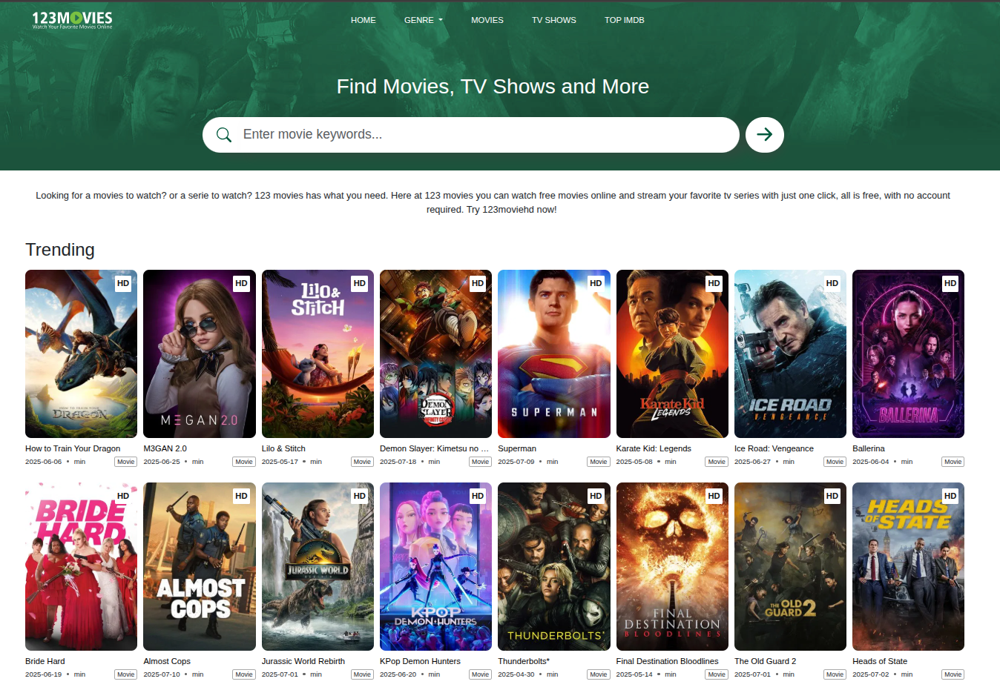

Watch Free Movies Online on 123movies - www.watch-123movies.online

### What Is 123Movies?

123Movies is a well-known streaming website that provides users access to a vast catalog of movies and television shows without requiring payment or sign-up. Its content spans across genres, from Hollywood blockbusters and indie films to international cinema and popular TV series. It gained popularity due to its user-friendly interface, minimal buffering, and extensive video selection.

Originally launched in Vietnam, [123movies](https://watch-123movies.online) became a household name in the online streaming world but soon drew criticism and legal attention from governments and copyright agencies due to the nature of its services. Authorities argued that it facilitated copyright infringement, leading to several shutdowns over the years. However, like many similar platforms, mirror or clone sites continue to pop up under different domain names, ensuring the brand’s persistence.

- - -

### Purpose and Appeal of 123Movies

The main purpose of 123Movies is to provide __free, fast, and easy access__ to movies and TV shows. In a world where streaming platforms such as Netflix, Disney+, and Amazon Prime charge monthly fees and often limit content based on region, 123Movies offers an appealing alternative—especially to users in countries where access to paid services is limited or expensive.

Key features that attract users include:

*   **No subscription required**: You don’t need to create an account or enter credit card details.
    
*   **Vast content library**: Thousands of titles available, including newly released movies.
    
*   **Multiple streaming links**: If one server doesn't work, another likely will.
    
*   **Global accessibility**: Available in many countries through different domains.
    

- - -

### How to Use 123movies Free Online Movie Streaming Sites to Watch Free Movies Online

Accessing 123Movies is fairly straightforward. Here’s a simple step-by-step guide to help users navigate the platform:

1.  **Find a Working 123Movies Site**: Due to regular shutdowns, it's essential to look for a working mirror site or domain. Search terms like “123Movies new site” or “123Movies official site” can help locate an active version.
    
2.  **Search for Content**: Once on the homepage, you’ll notice a search bar at the top. Simply type the name of the movie or TV show you wish to watch.
    
3.  **Select and Play**: Choose the relevant title from the results, then scroll down to find various streaming options. Select a server, press play, and enjoy.
    
4.  **Close Pop-ups Carefully**: These sites often include aggressive ads and pop-ups. Be cautious and avoid clicking suspicious links or download buttons.
    
5.  **Adjust Video Quality**: Many streams allow viewers to choose between SD and HD quality based on internet speed.
    

It’s important to note that while the process is simple, the risks involved are significant. Many of these mirror sites are hosted in countries with lax copyright enforcement, and their legality is questionable in many jurisdictions.

- - -

### Legal Risks and Why You Should Use a VPN

Streaming copyrighted content from unauthorized platforms like 123Movies may violate copyright laws in many countries. Even if you're only viewing and not downloading, your IP address can be tracked by internet service providers (ISPs), government agencies, or copyright enforcers.

This is where a **VPN (Virtual Private Network)** becomes crucial.

#### What Is a VPN?

A VPN is a tool that encrypts your internet connection and hides your real IP address by routing your traffic through a remote server. It helps protect your privacy and offers additional security when browsing or streaming on websites that may not be secure.

#### Benefits of Using a VPN for Streaming:

*   **Anonymity**: Keeps your online activity private and hides your location.
    
*   **Bypass Geo-blocks**: Access content that may be restricted in your country.
    
*   **Avoid ISP Throttling**: Prevents your internet provider from slowing down your connection when streaming.
    
*   **Enhanced Security**: Protects your device from potential malware embedded in ads or pop-ups.
    

Popular VPNs for streaming include NordVPN, ExpressVPN, Surfshark, and CyberGhost. These services often come with dedicated servers optimized for streaming, ensuring smooth playback and quick loading.

- - -

### Final Thoughts: Stream Wisely and Stay Protected

123Movies, despite its legal controversy, continues to attract a global user base thanks to its simplicity, accessibility, and free content. While it offers a tempting solution for those looking to watch movies and TV shows without spending money, it also comes with considerable risks, including legal consequences, malware exposure, and data theft.

If you choose to visit such a site, it is **strongly recommended** that you take protective measures, such as using a reputable VPN, activating an ad blocker, and keeping your antivirus software up to date. Most importantly, always be aware of the laws in your country regarding streaming content from unofficial sources.

As digital entertainment continues to evolve, the debate between paid streaming and free access will remain. In the meantime, platforms like 123Movies will likely continue operating in some form—hidden behind new domains and masked by VPNs—offering entertainment to millions around the world who are seeking an alternative.
